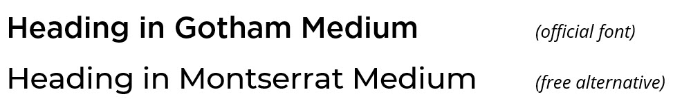
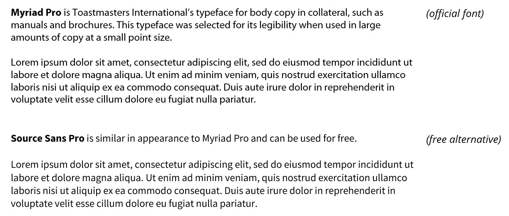

# Toastmasters Toolbox
General Toastmaters material that goes beyond the offerings from International and stays in their branding guidelines.

# 

For the Toastmasters branding guideslines, visit their [2022 Brand Manual](https://toastmasterscdn.azureedge.net/medias/files/brand-materials/brand-items/brand-manual_2022.pdf). For logos, visit their [logo page](https://www.toastmasters.org/logos).

## Contents

In the Toastmasters Toolbox, you'll find:

* Fonts
* Microsoft Office Themes
* Microsoft Office Templates

## Fonts

### Headings / Primary Typeface

***Gotham***   is Toastmasters International’s primary typeface. The wide stance and geometric traits of its characters exude confidence without looking stiff or digitalized.  ***Montserrat*** is similar in appearance to Gotham and can be used for free.

| Item                |                ||
|---------------------|----------------|----|
| **Gotham**          | Official Font  |    |
| **Montserrat**      | Free Option    | [Free Download](https://fonts.google.com/specimen/Montserrat#standard-styles) |
 
 Here is how they compare:

### Body
***Myriad Pro*** is Toastmasters International’s typeface for body copy in collateral, such as manuals and brochures. This typeface was selected for its legibility when used in large amounts of copy at a small point size. ***Source Sans Pro*** is similar in appearance to Myriad Pro and can be used for free.

| Item                |                ||
|---------------------|----------------|----|
| **Myriad Pro**          | Official Font  |    |
| **Source Sans Pro** | Free Option    | [Free Download](https://fonts.google.com/specimen/Source+Sans+Pro) |
 
 Here is how they compare:

---

## Themes

